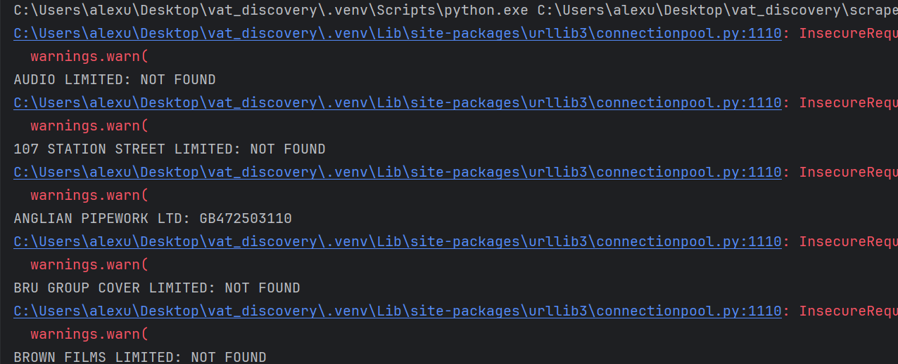
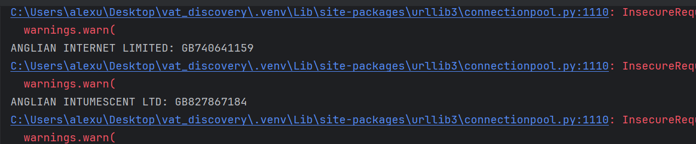
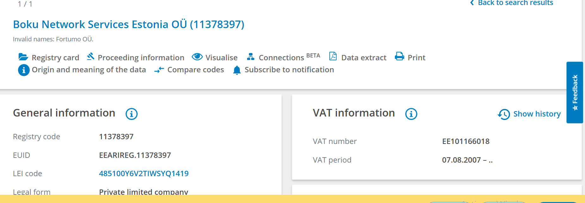

# VAT Identifier Discovery
## Part 1: Research

The goal was to determine whether a UK VAT registration number can be reliably discovered from publicly available information, starting from a list of UK companies that don't have one on file.
HMRC's tool is built for verification, not discovery. You can confirm whether a specific VAT number is valid, but you cannot look up a number by searching for a company name, HMRC requires the number in hand before running the check.
My approach: company -> candidate VAT number(s) from third-party sources -> verify with HMRC -> valid/invalid/not found. For each result I tracked coverage, precision, false positives, false negatives (not found), and which source it came from.

### Sample selection
I picked the 25 companies completely at random from the Companies House file, not ones I already suspected had a public VAT number. The point was to see how a script would actually perform on an unbiased sample, since cherry-picking companies I already knew had VAT info published would have made the results look much better than they'd really be.

### Manual search (25 companies)
I downloaded a file from Companies House and randomly selected 25 companies to search for VAT numbers manually. For each one, I first searched the company name plus "VAT" on Google, then checked the company's official website to see if a VAT number was listed there.
Results:
- 'AVE IT MEDIA LTD - found something, but not a valid VAT
- 'B' SAFE ELECTRICAL SERVICES LIMITED - not found
- 'BASICALLY PLANTS WILL SAVE US' LIMITED - not found
- 00 ADVERTISING, LTD. - not found
- AUDIO LIMITED - found on open.endole.co.uk
- 00 BAR LIMITED - not found
- 00 CABS LIMITED - not found
- 107 STATION STREET LIMITED - found on sciensus / sps.nhs.uk
- 107 STORMONT ROAD LIMITED - not found
- 107 SUNNYHILL ROAD RTM COMPANY LTD - not found
- ANGLIAN INTERNET LIMITED - not found
- ANGLIAN INTUMESCENT LTD - not found
- ANGLIAN IT LTD - not found
- ANGLIAN KNIGHT LTD - not found
- ANGLIAN PIPEWORK LTD - found on open.endole.co.uk
- BRU GLOBAL LIMITED - not found (for the UK entity)
- BRU GROUP COVER LIMITED - found on Bringo
- BRU HOLDINGS LTD - not found; listed as a dormant company
- BRU HOUSE COFFEE COMPANY LTD - not found
- BRU HUB LTD - not found
- BROWN FEATHER LTD - not found
- BROWN FILMS (INDIAN SUMMER) LIMITED - not found
- BROWN FILMS LIMITED - found on VAT-Lookup
- BROWN FINANCIAL SERVICES LIMITED - found, but for a different company (Performance Lead Limited, GB276316588)
- BROWN FINCH LIMITED - found, but for a different company (Finch Consulting Limited, 616596220)

I searched using company websites and third-party databases such as Endole, Bringo, and VAT-Lookup.co.uk. These sources were useful for finding possible VAT numbers, but they are not official and the information can sometimes be inaccurate or matched to the wrong company. Because of this, I treated every VAT number as a candidate and checked it afterward against HMRC, which let me confirm which ones were actually valid and belonged to the correct company. Two of the manually found results (Brown Financial Services, Brown Finch) turned out to belong to entirely different companies once checked this way, an early sign of the false-positive risk that later shaped how I built the script.

### Automating the search (VAT-Lookup.co.uk)
I set up a PyCharm project and inspected VAT-Lookup.co.uk through DevTools: I entered a company name in the search box and checked the Network tab to see what kind of request the form sent. It turned out to be a POST request.
Getting the script working took a few iterations. My first run against the companies I'd already checked manually returned only one "FOUND", everything else came back "NOT FOUND." At first this looked like a script problem, but after inspecting the raw response I realized the search results page genuinely does return matches, just not exact ones: for example, searching "BROWN FILMS LIMITED" returned "BROWN BEAR FILMS LIMITED" and "BROWN BAG FILMS UK LIMITED" instead. This confirmed something important: no single source covers everything, and each third-party source has its own partial database, so getting good coverage means combining multiple sources rather than relying on just one.
Once I filtered strictly for an exact name match (rather than accepting the top fuzzy result), the script started working correctly. I first tested it on 5 companies to confirm the logic, then ran it on the full set of 25.

Interestingly, it found VAT numbers for two companies (ANGLIAN INTERNET LIMITED, ANGLIAN INTUMESCENT LTD) that I had marked "not found" during my manual search — a good reminder that automation doesn't just reproduce manual results, it can catch things a manual pass misses, since a script checks every entry the same way, without the fatigue or inconsistency of doing it by hand.
I verified all found VAT numbers against HMRC, and all were valid. In total, out of 25 companies, the script found 4 (16% coverage) and left 21 not found.

### Attempting a second source (Bringo): dead end
I tried to automate lookups against Bringo next, using a company's Companies House number (Bringo's profile URLs follow the pattern bringo.co.uk/company/{number}). The request returned a 403 status instead of the expected page. Looking at the response, it was a Cloudflare bot-protection challenge page ("Just a moment...", referencing challenges.cloudflare.com), a mechanism that blocks simple automated requests and requires solving a challenge to prove the request comes from a real browser, not a script.
Bypassing this would require a headless browser (e.g. Selenium or Playwright) capable of executing JavaScript and solving the challenge, which adds real complexity and cost at scale, exactly the kind of scaling trade-off this task asks me to reason about. I didn't attempt to bypass it further; I'm treating this as a documented dead end rather than a bug to fix.

## Part 2: Proof of Concept
### False Positive Rate. Automated Source (VAT-Lookup.co.uk)
Out of 25 companies tested, the automated script found VAT numbers for 4 of them (16% coverage). All 4 checked out against HMRC's official checker, a 0% false positive rate on this batch.
That's a real improvement over the manual search I did first, where 2 out of roughly 7 "found" results actually belonged to a different company than the one I'd searched for, a false positive rate of about 29%. The difference comes down to the exact-name-match filter in the script: VAT-Lookup.co.uk returns fuzzy matches (Levenshtein-distance similarity, by their own description), so taking the top result which is what I did manually at first, risks landing on a similarly-named company instead of the right one. Filtering for an exact match before accepting anything removes that failure mode, though it costs some recall: a real match can get missed if the name in the source doesn't line up exactly with Companies House's registered name, say because of punctuation, abbreviations, or a trading name.
Worth flagging that this 0% comes from a small sample(just 4 matches) so it's not a strong guarantee at scale. A larger batch could still turn up edge cases, like two genuinely different companies sharing an identical registered name. What it does show is that the exact-match approach is sound in principle: every match it accepted turned out to be correct.

## Part 3: What I'd do with real resources
### Is Bringo worth it?
I wouldn't start by paying for an unblocking service or a headless browser. First I'd check how much value Bringo actually adds over what I can already reach. If it finds VAT numbers that Endole and the rest keep missing, a proper scraper setup is probably worth it. If the others already cover similar ground, it isn't.
On cost, I wouldn't guess a number without testing a provider, it depends on page volume and how aggressive the anti-bot setup is. I'd put maybe a few hundred euros a month toward an initial crawling test, then check that against how many extra VAT numbers it actually finds, roughly cost per additional VAT, so the decision comes from real value and not just "one more source."
And I wouldn't try to get around Cloudflare directly. Either a crawling method the site's terms actually allow, or a different source.

### Combining sources into a pipeline
I wouldn't lean on one source. Something like:
Companies House -> Endole -> Bringo -> VAT-Lookup -> company website -> public documents
Each one returns `company_number, company_name, candidate_VAT, source, timestamp`, with matching and verification as a separate step after. If one source breaks or disappears, the whole thing doesn't go down with it.

### Resolving conflicts
Skip majority-wins, give each source a trust level instead: HMRC-verified -> official document/invoice -> company website -> third-party aggregator.
An invoice beats the website because a website can be outdated or show a parent company's number, while a recent invoice is tied to the exact entity that issued it. So if Endole says GB123, Bringo says GB456, the website also says GB123, and HMRC confirms GB123 with a matching name, GB123 wins. If Endole says GB123 and Bringo says GB456 with nothing to break the tie, I wouldn't guess, I'd flag it. A wrong VAT number is worse than a missing one: it corrupts every join quietly downstream, a gap at least shows up.

### Handling "not found"
Not found doesn't mean not registered. It means not found yet, with a second round to try: company website, invoices, Companies House filings, procurement records, other databases, maybe a commercial source. Only after that would it actually get marked not found, and even then, HMRC's checker needs the number already in hand, it can't tell you if one exists.

### HMRC verification at scale
Yes, automate it. It's one of the most important pieces. HMRC has a Check a UK VAT Number API that returns the company name and address and can give a reference number for a confirmed check. At scale this replaces the manual checking here with something systematic across the whole dataset.

## Debate Topics
### 1. Brute-forcing the checksum
I'm fairly cautious here. From what I understood in my research, a VAT number follows certain structural rules and can be checked mathematically through a checksum. By checksum I mean a mathematical rule applied to the digits of an identifier to check whether the number has a valid structure. In other words, the checksum can tell you whether a number "looks like" a valid identifier, but it can't tell you who it actually belongs to.
In theory, you could generate combinations of numbers, keep only the ones that pass the checksum check, and then see which ones HMRC recognizes. That said, I don't think this is a good approach for discovery. Even if a VAT number passes the checksum, that doesn't mean it's assigned to the company you're actually looking for. You'd end up generating a huge number of variants and firing off a huge number of requests to HMRC, with no real connection between the number and the company you started with.
There's also the question of rate limits, request volume, and how long verification would actually take. I don't know HMRC's infrastructure well enough to say whether an approach like this could be feasible at very large scale, but from what I understand, it feels more like a theoretical idea than something I'd actually use in production.
My instinct would be to go the other way around: first discover candidate VAT numbers from public sources, like the company website, public documents, or secondary databases, and then use HMRC for verification. That way, the checksum can serve at most as an extra format filter, while HMRC stays the part that actually confirms the number.

### 2. Keeping the dataset current
I'd treat keeping the dataset current as an ongoing process, not something you do once. The problem is that information about a company can change over time, including its address, its status, or even VAT-related details.
An important concept here is ground truth, meaning a source or dataset you consider reliable enough to use as a reference when checking your own results. In this project, the issue is that there's no complete ground truth for every company in the UK, since HMRC doesn't publish a public dataset you can search by company name to find a VAT number directly.
Because of that, I'd keep track not just of the VAT number found, but also the source, the date it was found, and the date of the last HMRC verification. For important companies, I'd re-verify periodically and re-run discovery if something changes.
I don't know what the ideal frequency for this would be in a real system. My first instinct would be monthly or quarterly checks, depending on how often the data actually changes and how important it is for the information to stay current. This is something I'd want to understand better, how that frequency actually gets decided in a real product.

### 3. Detecting errors without ground truth
This one's harder for me to answer with much confidence, since I don't have a full reference dataset to compare against, only what I found through HMRC checks on a small sample. My best guess is that if multiple independent sources happen to agree on the same VAT number for the same company, that's a decent signal it's probably correct. I'd also keep an eye on the "not found" rate over time — if it suddenly jumps for no clear reason, something likely changed on the source side (a site updating its page structure, for example) rather than the companies themselves suddenly losing their VAT numbers. Beyond that, I think this would need periodic manual spot-checks on a small sample, just to catch things that don't show up any other way. I'm sure there are better/more systematic approaches used in production systems, but this is as far as I could reason it out on my own.

### 4. Sources I wouldn't rely on for a commercial product
Here I'd draw a line between sources for discovery and sources I'd actually rely on for the final result.
Endole, Bringo, and VAT-Lookup.co.uk were genuinely useful for research and discovery, since that's where I actually managed to find VAT numbers. But I wouldn't consider them sufficient on their own for a commercial product.
The reason is that they're secondary, aggregator-type sources, and I saw firsthand in my own process that they can return wrong results or match the wrong company entirely. That's why, for a commercial product, I'd want something closer to: source -> candidate -> verification -> final result —>> rather than: Endole -> VAT = definitely correct.
In my case, HMRC matters far more for verification than the aggregator the number was originally found through. I'd also check the usage rights and licensing of a data source before using it commercially, not just whether I'm technically able to access it.

## Beyond the UK
### Estonia (a much easier case) 

To compare against the UK, I picked 3 Estonian companies at random from a list I found online (Enimex, Fortumo, Nortal) and searched for them directly on the Estonian e-Business Register by name. All the information I needed (including the VAT number) appeared immediately on each company's page, sourced from the Tax and Customs Board (Estonia's equivalent of HMRC). 
To make sure the results were legitimate, I separately searched each company on Google and compared what I found against the register's data. Everything matched, which gave me confidence that the register itself is a reliable, trustworthy source. 

Compared to the UK, where I had to search across multiple unofficial third-party sources and then verify each result separately to rule out mismatches between similarly-named companies, Estonia is dramatically simpler. The VAT number is attached directly to the company record, along with useful extra context like the exact period it's been active (start date, and end date if applicable), something the UK process doesn't surface at all. This would also be far easier to automate than the UK pipeline: a single official source, one clean lookup by company name, no fuzzy matching or cross-referencing needed.

## Cyprus (harder, but for a different reason than expected) 

I approached Cyprus the same way as Estonia: searching for random Cypriot companies and looking for a source that could show me the VAT number. I found a site called VATVerified, where entering a company name returned detailed information about it. 
For the first company I searched, Apollon Limassol, the VAT number was shown directly. For the second, Cyprus Broadcasting Corporation, the site asked me to pay to reveal the VAT number, the free tier only allows one reveal, with a policy of two reveals per month. Without a paid subscription, I couldn't access VAT information for additional companies beyond that limit. 

This points to a different kind of difficulty than the UK case. It's not that the data doesn't exist or is hard to match (VATVerified clearly has it) but that free, unrestricted access is limited by design. For discovery at scale, this means Cyprus would likely require a paid data source rather than something that could be automated for free the way I did with VAT-Lookup.co.uk for the UK. 
I also checked the official Cyprus registry (companies.gov.cy) directly, searching for the same companies by name. No VAT number appeared anywhere on the official company records, only basic details like registration status and directors. This is a meaningful difference from Estonia, where VAT information is built directly into the official registry record. In Cyprus, VAT information seems to live entirely outside the official government registry, in third-party sources like VATVerified, which explains why it's paywalled: there's no free official alternative that surfaces it directly. 
Ranking these three by how hard VAT discovery actually is, easiest to hardest: Estonia, then the UK, then Cyprus. Estonia has a free, official registry with VAT built right into the company record, so discovery is mostly a solved problem there. The UK has no official VAT lookup, but at least the third-party sources filling that gap (VAT-Lookup.co.uk, Endole) are free, even if fragmented and prone to fuzzy-match errors. Cyprus is the hardest of the three: its official registry doesn't show VAT at all, and the one source I found that does, VATVerified, paywalls access after a couple of free lookups. Discovery at scale there means paying for data from the start, not building a free pipeline the way I did for the UK. 
This lines up with something from the debate topics earlier: "hard" isn't one problem. For the UK, verification through HMRC is easy and free, but discovery is genuinely hard. For Cyprus, verification through VIES is probably fine too, but discovery is hard for a totally different reason, not because the data doesn't exist, but because free access to it is deliberately capped. A country-by-country rollout would need to treat these as separate problems: unified official registries like Estonia's are the easy wins, fragmented-but-free setups like the UK's take real engineering effort, and paywalled markets like Cyprus's come down to a budget decision more than a better scraper. 